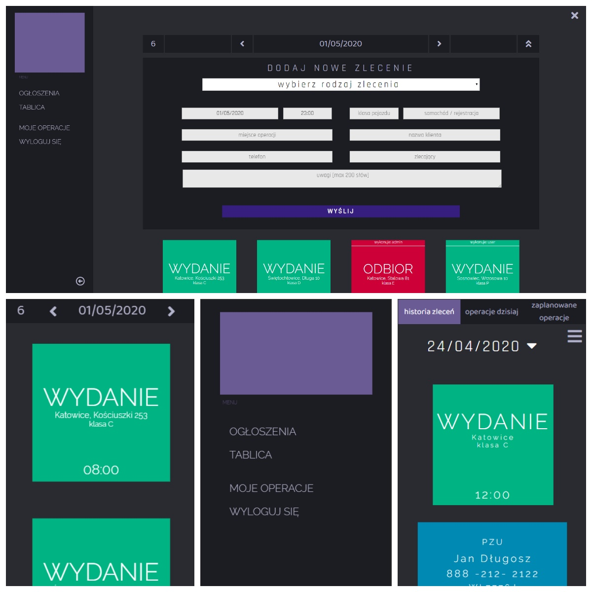

# Car Rental Notes 

>Car Rental Notes, responsive web app created in ASP .NET MVC using HTML, JavaScript, CSS, and Entity Framework. 

### Table of contents:
* [General info](#general-info)
* [Technologies](#technologies)
* [Running Project](#running-project)
* [Main Features](#main-features)
* [Screenshots](#screenshots)
* [Status](#status)
* [Contact](#contact)

## General info:

> I wanted to transfer the traditional pinboard with different notes, which were very important job tools in my last job in car rental to employees computers and smartphones. This solution increases comfort and makes that the exchange of information inside the company simpler and faster. My application has a lot of useful functions, modern design, and is responsive.

## Technologies:

- ASP.NET MVC,
- Entity Framework.

## Running Project:

+ git bash: ` git clone https://github.com/karolswiderski/car-rental-notes`
+ in ` web.config ` file change the connection string according to your system:
```csharp
    connectionString="Data Source=(LocalDB)\MSSQLLocalDB;AttachDbFilename=[...]\car-rental-notes\car-rental-notes\App_Data\car-rental-notes-localdb.mdf;Integrated Security=True" providerName="System.Data.SqlClient" /></connectionStrings>
```
+ Run the project. Go to http://localhost:xxxx/Account/Login and login to account:
`login: admin password: admin | login: user password: user`

## Screenshots:




## Main Features:
 
- Intuitive access to board with notes sorted by days,
- Adding new note and deleting existing ones,
- User Accounts with function which adding note to a user account,
- Board with announcements.

## Status:

The project is finished.

## Contact: 

Created by Karol Świderski. 
[linkedin ](https://github.com/karolswiderski/)
[github ](https://github.com/karolswiderski/)
kswiderski98@gmail.com

## END


